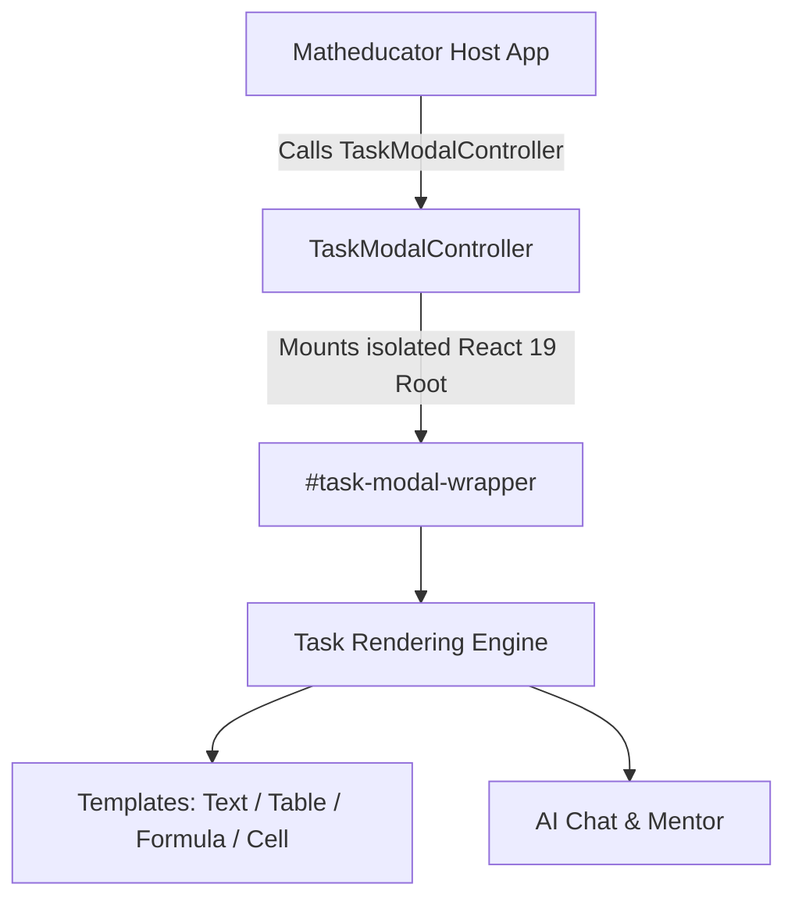

# 📦 @qalan/new-task-modal

[](https://react.dev)
[](https://www.typescriptlang.org/)
[](https://vitejs.dev/)
[](https://storybook.js.org/)

Изолированная React 19 библиотека (ESM) для отображения интерактивных учебных заданий, решения задач, чата с AI/менторами и отслеживания прогресса учеников на платформе Qalan.

---

## 📚 Документация (Documentation Portal)

Вся документация проекта структурирована в директории [`docs/`](./docs/):

| Раздел | Описание |
| :--- | :--- |
| 🚀 **[Быстрый старт](./docs/1-getting-started/quickstart.md)** | Установка, локальный dev-сервер, запуск Storybook и связка с хостом. |
| 🔰 **[Чек-лист разработчика](./docs/1-getting-started/onboarding-cheatsheet.md)** | Быстрый обзор структуры, правил разработки и команд. |
| 🏗️ **[Архитектура](./docs/2-architecture/overview.md)** | Обзор устройства системы, изоляции стилей и версий. |
| 🔌 **[Интеграция с хостом](./docs/2-architecture/host-integration.md)** | Webpack Alias, жизненный цикл `TaskModalController` и `deps`. |
| 🔄 **[Потоки данных и состояние](./docs/2-architecture/data-flow-and-state.md)** | Связка Zustand v5 (клиент) и TanStack Query v5 (сервер). |
| 🧩 **[Каталог шаблонов заданий](./docs/3-templates-and-tasks/overview.md)** | Описание шаблонов (Text, AnswerCell, Formula, ColumnOperation и др.). |
| ➕ **[Создание нового шаблона](./docs/3-templates-and-tasks/add-new-template.md)** | Пошаговый гайд по реализации нового типа задания. |
| 📖 **[API: TaskModalController](./docs/4-api-reference/task-modal-controller.md)** | Полная спецификация пропсов, действий и зависимостей. |
| 💬 **[API: Модуль Чайта](./docs/4-api-reference/chat-module.md)** | Описание интерфейса AI-чата и Менторов. |
| 📜 **[Architecture Decision Records (ADRs)](./docs/5-adrs/0001-webpack-alias-distribution.md)** | Реестр принятых архитектурных решений. |
| ⚠️ **[Gotchas & FAQ](./docs/6-troubleshooting/gotchas-and-pitfalls.md)** | Частые ошибки, ловушки и ответы на вопросы. |

---

## ⚡ Быстрый пример использования

```tsx
import TaskModalController from '@qalan/new-task-modal'

// Вызывается при открытии задания в хост-приложении
TaskModalController({
  activeTask,
  deps,
  state,
  setState,
  hostProps,
  actions,
  closeModal: () => { console.log('Модальное окно закрыто') },
})
```

> **Важно**: В DOM хост-приложения должен присутствовать элемент `<div id="task-modal-wrapper"></div>`.

> **Важно**: Папки [`grades/grade-3/`](./src/modules/tasks/ui/grades/grade-3/) и [`grades/grade-6/`](./src/modules/tasks/ui/grades/grade-6/) не про 3 и 6 класс — все задания в них реально показываются ученику **4 класса**. Номер папки взят из типа задания (`Task_3_7_*`, `Task_6_6_*`), не из реального класса урока. Детали — в [Gotchas & FAQ](./docs/6-troubleshooting/gotchas-and-pitfalls.md), пункт 5.

---

## 🛠️ Команды разработки

```bash
# Установка зависимостей
pnpm install

# Запуск dev-стенда (http://localhost:5173)
pnpm dev

# Запуск Storybook (http://localhost:6006)
pnpm storybook

# Сборка в режиме watch для синхронизации с matheducator
pnpm build:watch
```

---

## 🗺️ Общая схема взаимодействия


