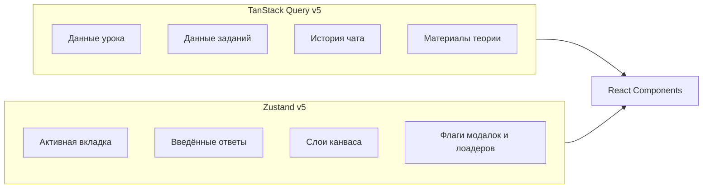
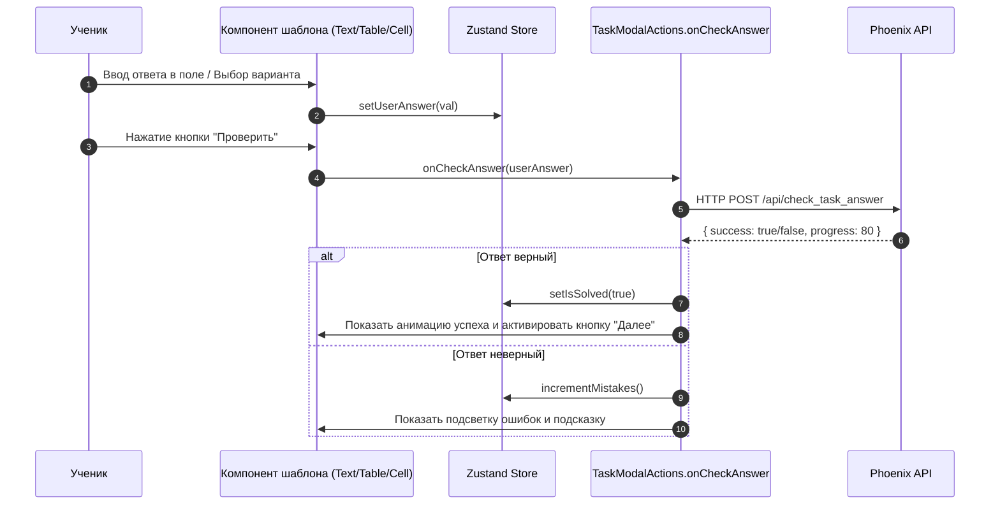

# 🔄 Потоки данных и Управление состоянием (Data Flow & State)

Разбор архитектуры управления состоянием и обмена данными внутри библиотеки `@qalan/new-task-modal`.

---

## 🗂️ Стратегия управления состоянием

В проекте применяется чёткое разделение ответственности между **серверным** и **клиентским** состоянием:

---

## 🟢 1. Клиентское состояние (Zustand)

Для локального UI-состояния применяется lightweight-стор Zustand (`src/modules/tasks/model/use-task-store.ts`):

### Поля Zustand Store:
- `userAnswer`: Хранит текущий ответ ученика (строку, массив ответов или выбранные индексы).
- `isChecking`: Флаг проверки ответа.
- `isSolved`: Проведено ли успешное решение текущего задания.
- `mistakesCount`: Количество ошибочных попыток на текущем задании.

---

## 🔵 2. Серверное состояние (TanStack Query)

Все запросы к backend выполняются через обёртки React Query (`useQuery`, `useMutation`), использующие `deps.api`:

- `useLessonQuery(lessonId)`: Получение информации об уроке и списка заданий.
- `useCheckAnswerMutation()`: Отправка ответа на проверку и обновление локального прогресса.
- `useChatMessagesQuery()`: Получение истории диалога с AI-помощником.

---

## 📝 3. Жизненный цикл ввода и проверки ответа

---

## 💬 4. Поток данных Чайта (AI / Ментор)

1. **AI-Чат**: Работает через `WebSocket` (`deps.socketController`). При отправке сообщения клиент эмитит событие `send_ai_message`, ответ приходит потоково (streaming) и отображается в реальном времени.
2. **Чат Ментора**: Запросы отправляются через REST API с уведомлениями о новых ответах через WebSocket.
