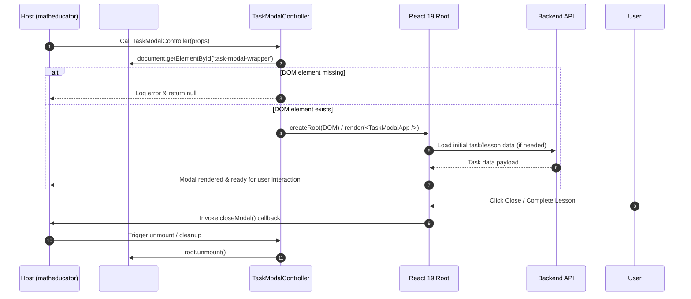

# 🔌 Интеграция с хост-приложением (Host Integration)

Подробный разбор механики подключения библиотеки `@qalan/new-task-modal` к хост-приложению `matheducator`.

---

## 🛠️ Механизм сборки и Webpack Alias

Хост-приложение (`matheducator/reactjs_client`) находится в монорепозитории/соседней директории. Оно подключает `new-task-modal` **не через npm-пакет**, а напрямую через **Webpack Alias**, указывающий на `dist/`:

```javascript
// matheducator/reactjs_client/webpack.config.js (или alias config)
resolve: {
  alias: {
    '@qalan/new-task-modal': path.resolve(__dirname, '../../new-task-modal/dist')
  }
}
```

Это позволяет:
- Избежать накладных расходов на `npm publish` / `yalc`.
- Использовать `pnpm build:watch` для мгновенного hot-reload при разработке.

---

## 🔁 Жизненный цикл монтирования (`TaskModalController`)

При вызове `TaskModalController` происходят следующие шаги:

1. **Поиск контейнера**: Контроллер ищет DOM-элемент `#task-modal-wrapper`.
2. **Создание React Root**: Если root еще не создан, вызывается `createRoot(container)`.
3. **Рендеринг дерева**: Монтируется компонент `TaskModalApp` с контекстами зависимостей (`deps`), пропсов и действий.
4. **Размонтирование**: При вызове `closeModal()` или закрытии окна происходит очистка React Root (`root.unmount()`).

### Mermaid Sequence Diagram



---

## 📦 Инжектируемые зависимости (`deps`)

Библиотека не производит прямых обращений к глобальным объектам window или `matheducator`. Все внешние утилиты передаются через объект `deps`:

```typescript
export interface TaskModalDependencies {
  api: HttpClient                      // Вызовы Phoenix REST API
  global: GlobalState                  // Данные роли, профиля
  localize: (key: string) => string    // Локализация
  lodash: typeof lodash                // Утилиты lodash
  enums: Record<string, any>           // Перечисления хоста
  toast: ToastService                  // Уведомления (react-toastify)
  socketController: SocketController   // WebSocket контроллер
  cookies: CookiesService              // Работа с cookie (js-cookie)
  helpers: {                           // Математические и тексты helpers
    TaskHelper: any
    CyrillicTo: any
    ArabicNumeralUtils: any
  }
  eventEmitter: EventEmitter           // Шина событий для взаимодействия с хостом
  alert: AlertService                  // Уведомления об ошибках/успехах
}
```

---

## ⚡ Инжекция стилей

В `vite.config.ts` используется плагин:

```typescript
import cssInjectedByJs from 'vite-plugin-css-injected-by-js'

plugins: [
  cssInjectedByJs()
]
```

При импорте `@qalan/new-task-modal` стили автоматический встраиваются в тег `<head>` DOM-дерева страницы хоста. Все классы изолированы с помощью CSS Modules для исключения каскадных конфликтов с хостом.
