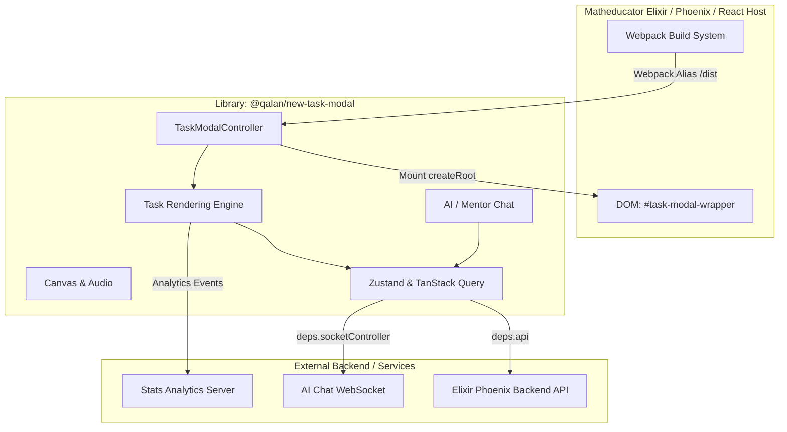

# 🏗️ Обзор архитектуры (Architecture Overview)

Модуль `@qalan/new-task-modal` — это автономная React-библиотека (ESM), спроектированная для отображения интерактивных учебных заданий, решения задач, чата с AI/менторами и отслеживания прогресса ученика.

---

## 🧭 Ключевые архитектурные принципы

1. **Изолированный ES-модуль**:
   Библиотека собирается Vite в единый JS-файл (`dist/index.js`) со встроенными стилями (`vite-plugin-css-injected-by-js`). Она не зависит от CSS-стилей и окружения хоста.

2. **Единая точка входа (`TaskModalController`)**:
   Хост-приложение запускает библиотеку через вызов функции `TaskModalController(props)`. Контроллер создаёт изолированный React Root (`createRoot`) внутри указанного контейнера DOM `#task-modal-wrapper`.

3. **Injected Dependencies (`deps`)**:
   Все внешние сервисы (HTTP API, событие `EventEmitter`, локализация, утилиты, куки) передаются через параметр `deps`. Это гарантирует отсутствие жестких связей между кодом модалки и инфраструктурой хоста.

4. **Двухуровневое состояние**:
   - **Серверное состояние**: Загрузка уроков, сохранение ответов, история чата через **TanStack Query (React Query v5)**.
   - **Клиентское состояние**: Переключение вкладок, ввод ответов, состояние канваса через **Zustand v5**.

---

## 📊 Диаграмма компонентов системы



---

## 📁 Модульная структура

```text
src/
├── modules/
│   ├── task-modal/      # Точка монтирования (Controller, React Root, Provider Context)
│   ├── tasks/           # Движок шаблонов заданий, динамические маппинги классов
│   ├── chat/            # Двухвкладочный чат (AI Ментор + Живой Ментор)
│   ├── canvas/          # Рисование решения на интерактивной доске
│   ├── audio/           # Озвучка формул и условий
│   └── testing/         # Стенды для изолированного тестирования
├── ui/                  # Переиспользуемые UI-компоненты (TopBar, Tabs, Buttons)
├── styles/              # SCSS токены, темы, миксины
└── types/               # TypeScript интерфейсы API и моделей
```
